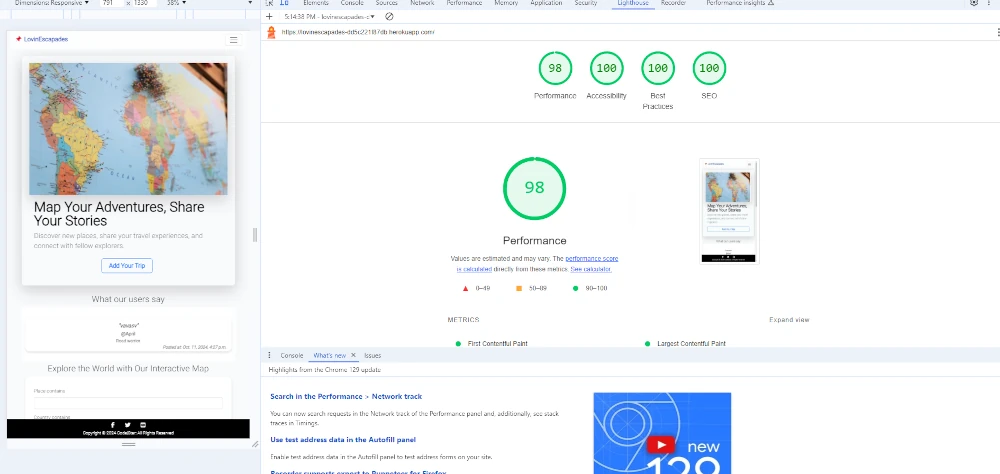
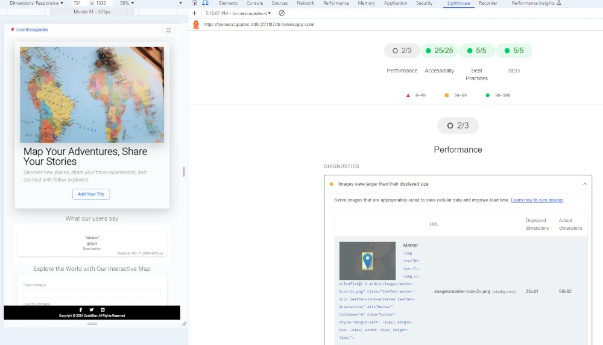
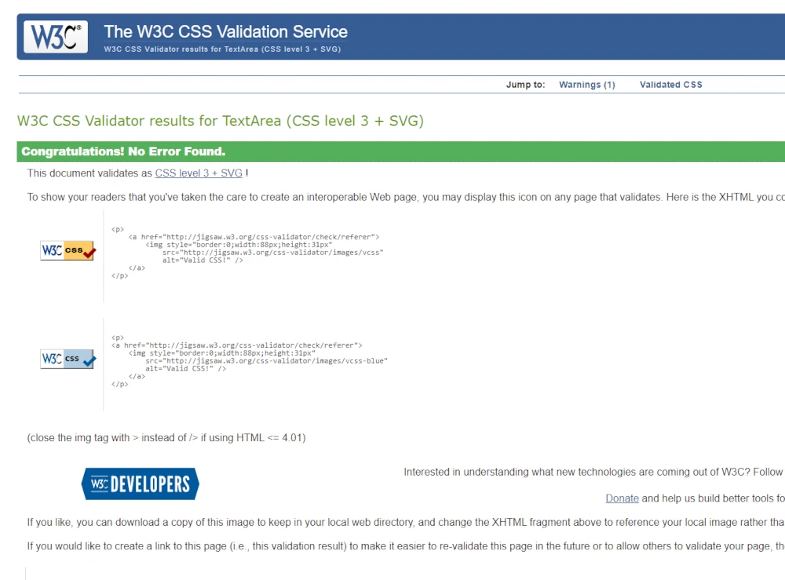
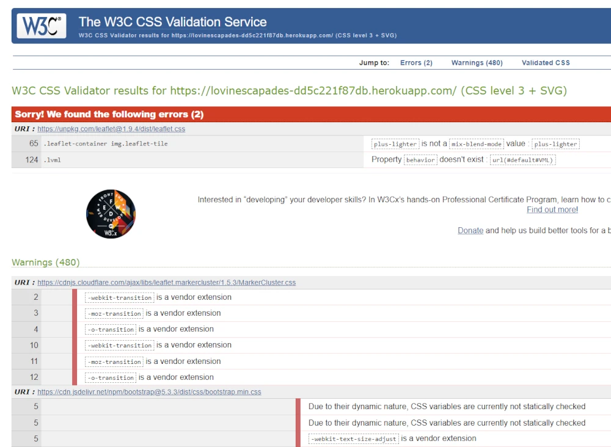
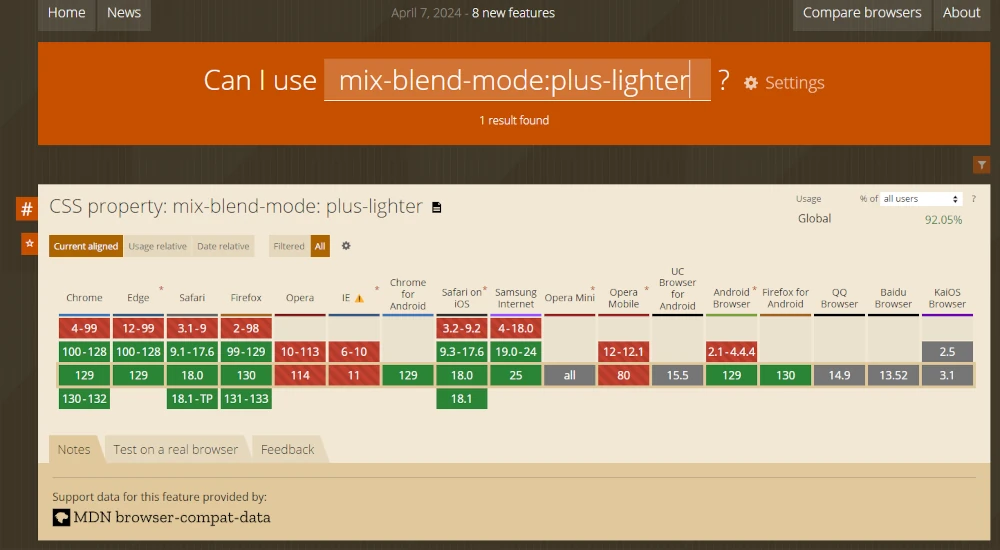
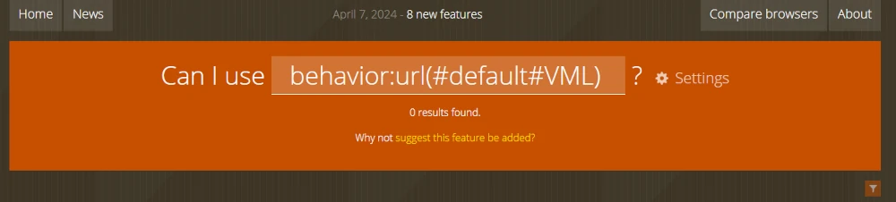
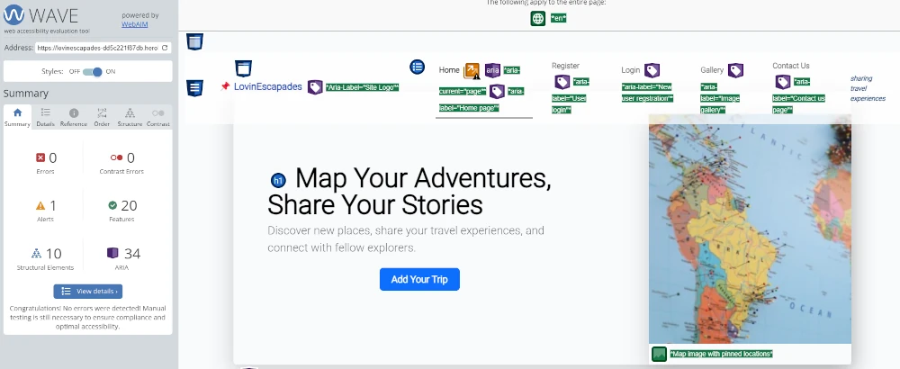
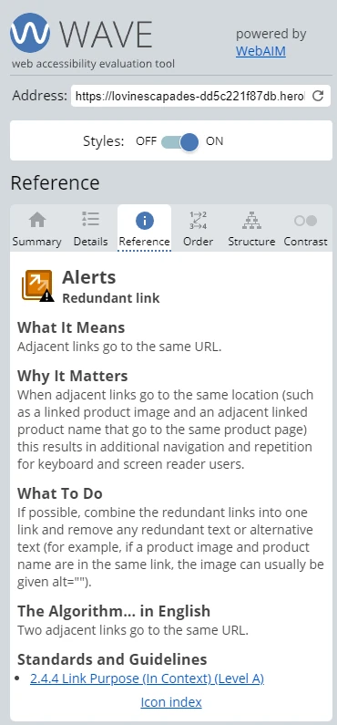
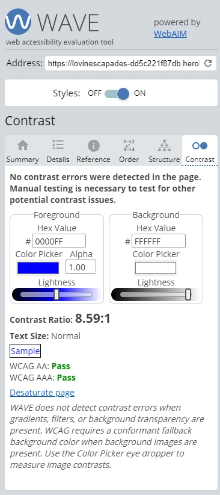

# ***<center><font color="red"> LovinEscapades</font>***: The Ultimate Trip Tracking Tool!</center>
## <center> A Django web app </center>

### **Table of content:**
- [Overview](#overview)
- [Application development](#application-development)
- [Main features](#main-features)
- [Technologies Used](#technologies-used)
- [Manual testing](#manual-testing)
- [Unit testing](#unit-testing)
- [Known bugs and issues](#known-bugs-and-issues)
- [Possible improvements](#possible-improvements)
- [Contributing](#contributing)
- [License](#license)
- [Acknowledgements](#acknowledgements)
- [Documentation version](#documentation-version)


## Overview

***LovinEscapades*** is a web CRUD application developed as part of Milestone Project 4 in the Full Stack Software Development program at Code Institute. This project showcases a complete full-stack Django development approach, utilizing:

- Python with the Django framework
- JavaScript with jQuery
- Custom CSS

In its present form, ***LovinEscapades*** allows registered users to:

- Log in via the `Log In` page using their username and password
- Create, update, edit, and delete information regarding their trips
- Upload and delete photos associated with a particular trip
- Share information about their trips and images with other users or unregistered site visitors
- Post testimonials (upon site admin approval) about their experiences with the site and its community

For site visitors who are not registered users, it is still possible to:

- View shared trip locations marked on a Leaflet map using georeferenced markers
- Navigate to the `Gallery` page via the links in the marker popups
- Send inquiries to the site admin from the `Contact Us` page
- Register on the site from the `Registration` page

Designed with user-friendliness in mind, ***LovinEscapades*** is an intuitive application aimed at helping users maintain focus and boost engagement. It's important to note that this app serves as a demonstration of acquired full-stack programming skills in fulfillment of the requirements of Milestone Project 4, rather than being a final product.

### Target Audience

***LovinEscapades*** targets travel enthusiasts and individuals who enjoy documenting and sharing their travel experiences. It appeals to users looking to organize their trips, connect with a community, and explore destinations through shared content. Designed with simplicity in mind, the platform suits both tech-savvy individuals and those new to online travel documentation, providing an intuitive space for managing itineraries and memories. The app is designed to accommodate a diverse user base, embracing individuals from varied geographic locales, cultures, and backgrounds globally, fostering a rich exchange of experiences and perspectives.


## Application development
The development of the ***LovinEscapades*** application followed an iterative approach, incorporating essential Agile principles. However, as I was still familiarizing myself with Agile methodologies, I found these principles challenging to follow consistently.

Much of the development process was guided by a trial-and-error approach, as I initially lacked a clear vision of the project content. Despite these challenges, I focused on implementing a select number of user stories to ensure progress.

The user stories were crafted using a custom template, structured as follows::

*<center>**Title:***</center>

*<center>**Description:***</center>
*<center>As a **[role]** I can **[capability]** so that **[received benefit]***</center>

*<center>**Acceptance Criteria:***</center>
*<center>Acceptance Criteria 1:*</center>
*<center>Acceptance Criteria 2:*</center>
*<center>Acceptance Criteria 3:*</center>

Key user stories that influenced development included:
- As a site visitor, I can register for an account or log in to an existing one, so I can access personalized features and services.
- As a registered user, I want the ability to create, edit, and delete a trip record.
- As a registered user, I can create and share my trip, allowing me to document my travel experiences and share them with others.
- As a site visitor, I want a view of shared trip locations and photos.

All the `User Stories` labeled in the `must have` category were fulfilled by the time of project submission.


*<center><font color="red">LovinEscapades</font>: Github Kanban baord with project User stories*.</center><br>


*<center><font color="red">LovinEscapades</font>: Custom template for User Stories*.</center><br>

During development, I encountered numerous bugs and conducted extensive code refactoring to adhere to the DRY (Don't Repeat Yourself) principle. Frequent Git commits were made throughout the process to ensure consistent progress tracking and effective version control.


[*Back to top*](#)


## Main Features

### **User Registration and Authentication:**
- Secure user registration and login system.
- Automatically creates a User Profile instance for new registrations.
- Allows registered users to follow others, currently accessible only via the admin page.

### **Trip Management:**
- Create, update, and delete trip entries with descriptions, locations, and dates.

### **Photo Gallery:**
- Upload and manage photos linked to each trip.
- Browse a gallery of all trip-related photos.

### **Interactive Map:**
- Show trip locations on a Leaflet map with markers.
- Connect map markers to trip details and photo galleries.

### **User Testimonials:**
- Submit testimonials on site experiences, pending admin approval.

### **Contact Form:**
- Contact page for user inquiries and feedback to site admin.

### **Error Handling:**
- Provides a smooth user experience by handling errors gracefully and delivering helpful messages.

### **Responsive Design:**
- Fully responsive design for seamless use across different devices and screen sizes.

### **Cross-Platform Accessibility:**
- Usable on any device with an internet connection, including mobile, tablet, and desktop.

### **Security:**
- Secures actions for logged-in users using `@login_required`.
- Utilizes the `AllAuth` extension for safe user registration and login.
- Limits access to sensitive information to authorized users, like site admins and data owners.

These features highlight the core functionalities of ***LovinEscapades***, showcasing its capabilities for user interaction, content management, and community engagement. 
More details about the app functionality are provided in the [Usage and Screenshots](#usage-and-screenshots) section.

[*Back to top*](#)


## Application structure

### ***Lovingescapades*** project consists of  three apps:

### 1. `trip`
This app features the `Dashboard` page, allowing users to:
- View updated counts of trips, uploaded photos, and testimonials awaiting approval.
- Decide if new trip information will be shared publicly or kept private. Public trips are mapped on the landing page, while private trips are visible only to the authenticated user.
- Quickly access trip details through trip card elements, which provide basic trip information (destination, start and end dates, creation date) along with options to edit/delete trips and upload/delete photos.
- Display approved user testimonials on the landing page and map the locations of shared trips.  

### 2. `user_profile`
The user profile app offers two primary sections:
- Profile update section for editing basic user information such as username, first and last name, and email address.
- Functionality for posting and deleting testimonials, which are subject to admin approval before appearing on the landing page.  

### 3. `contact`
This app provides essential functionality for site visitors to send inquiries to the site admin via a dedicated form.

### 4. `gallery`
- Hosts the photo gallery where all publicly shared photos by registered users can be viewed by any visitor.
- Users can publish photos even if they choose not to make the associated trip information public.
- Each photo in the gallery includes a like icon and basic trip details, though the feature for sending and receiving likes has not been implemented yet.


## Technologies Used

### **Django:** 
A web framework made with Python that helps build web apps quickly and efficiently. It's great for managing databases and organizing code, making it easier to create complex features for ***LovinEscapades***.

### **JavaScript:** 
A programming language that makes web pages interactive. It's used to add features like real-time updates and dynamic content that responds to user actions.

### **jQuery:**
A Javascript library that makes it easier to use JavaScript. It simplifies tasks like handling mouse clicks or animations, making the site more user-friendly.
The JQuery was included in the project via a Content Delivery Network (CDN) link. 

### **Bootstrap 5.3 CSS:** 
A toolkit for building websites that look good on all devices. It comes with ready-to-use designs, which help in quickly creating a clean and modern interface for the app.

### **Custom CSS:** 
Styles written specifically for ***LovinEscapades*** to personalize the look of the site, ensuring it matches the overall theme and design vision.

### **Leaflet JavaScript mapping library:** 
A tool for creating interactive maps that work well on different devices. It helps users see trip locations and explore the map easily.

### **Geopy Python Module:** 
A library that helps find geographic coordinates, like latitude and longitude, from place names. It’s used to show trip locations accurately on the map.

### **Django graph models:** 
[Django Extensions](https://shorturl.at/GxkSs) is a collection of custom extensions for the Django Framework that can be used for creating ER (Entity-Relationship) diagrams for the project database. These diagrams make it easier to visualize, understand, and manage the database structure. You can view these database model relationships using the online [GraphViz generator](https://shorturl.at/AAuhy). 

### **Python modules**
The following Python modules were installed using the `pip install` command in the terminal and were listed in the `requirements.txt` file:
- asgiref==3.8.1 
- cloudinary==1.36.0 
- crispy-bootstrap5==0.7
- dj-database-url==0.5.0
- dj3-cloudinary-storage==0.0.6
- Django==4.2.16
- django-allauth==0.57.2
- django-crispy-forms==2.3
- django-extensions==3.2.3
- django-filter==24.3
- geographiclib==2.0
- geopy==2.4.1
- gunicorn==20.1.0
- oauthlib==3.2.2
- pillow==10.4.0
- psycopg2==2.9.9
- PyJWT==2.9.0
- python3-openid==3.2.0
- requests-oauthlib==2.0.0
- sqlparse==0.5.1
- urllib3==1.26.20
- whitenoise==5.3.0

### **Javascript libraries**
- Leaflet 1.9.4 ([JavaScript library for mobile-friendly interactive maps](https://leafletjs.com/index.html))


### **Markdown**
The Markdown formatting for README.md and HELP.md files was done according to the documentation provided at
[www.markdownguide.org](https://www.markdownguide.org/basic-syntax/).


### Cloud deployment
The app is currently deployed on [Heroku Cloud Application Platform](https://www.heroku.com)
For cloud deployment, the [dependency requirements file](requirements.txt) was compiled using the
```
pip freeze --local > requirements.txt
```
command in the VSCode PowerShell. 

The processes to run on the Heroku platform are specified in the `Procfile`. 

Sensitive information is stored in the `env.py` file, which is listed in the `.gitignore` to prevent it from being uploaded to GitHub.

The app can be accessed at [***LovinEscapades***](https://shorturl.at/f4uCn).


[*Back to top*](#)


## Accessibility and Design

### Accessibility
- Attention was given to the ARIA (Accessible Rich Internet Applications) content, ensuring that screen readers can effectively retrieve information when needed.

### Fonts
- The font 'Lato' was chosen for the logo and related statement text. It is both legible and adds a rough, gritty   texture, breaking the clean visual of the site.
- The font 'Roboto' was used for general text, both offering a clean and easily readable appearance.

### Colors and Themes
- The website’s style is minimalistic, primarily based on predefined Bootstrap 5.3 themes and touches of custom CSS. This approach ensures good contrast and a decent aesthetic, supporting accessibility and visual appeal.

### Icons
- Font Awesome were used for the Logo, social media icons in the Footer, `My profile`-page link and like buttons on share photos in the ??`Gallery`-page. 


[*Back to top*](#)


## Usage and screenshots

- A quick demonstration of using the app can be found here: [***here.***](assets/giffs/Demo-functionality.gif)
- The user registraton process can be found here: [***here.***](assets/giffs/Demo-functionality-registration.gif)
- An example for the trip deletion process can be found here: [***here.***](assets/giffs/Demo-functionality-task-delete.gif)
- An example for adding a new trip can be found here: [***here.***](assets/giffs/Demo-functionality-task-add.gif)

[*Back to top*](#)


## Online Validators

### **PEP8**
The [Pep8 CI](https://pep8ci.herokuapp.com/) Python Linter returned no errors:

| App            | File         | CI Linter Result           |  Status |
| --- | --- | --- | --- |
| `trip`         | `forms.py`   | All clear, no errors found |  `pass`|
|                | `filters.py` | All clear, no errors found |  `pass`|
|                | `models.py`  | All clear, no errors found |  `pass`|
|                | `utils.py`   | All clear, no errors found |  `pass`|
|                | `urls.py`    | All clear, no errors found |  `pass`|
|                | `views.py`   | All clear, no errors found |  `pass`|
| `contact`      | `forms.py`   | All clear, no errors found |  `pass`|
|                | `models.py`  | All clear, no errors found |  `pass`|
|                | `urls.py`    | All clear, no errors found |  `pass`|
|                | `views.py`   | All clear, no errors found |  `pass`|
| `gallery`      | `forms.py`   | All clear, no errors found |  `pass`|
|                | `models.py`  | All clear, no errors found |  `pass`|
|                | `urls.py`    | All clear, no errors found |  `pass`|
|                | `views.py`   | All clear, no errors found |  `pass`|
| `user_profile` | `forms.py`   | All clear, no errors found |  `pass`|
|                | `models.py`  | All clear, no errors found |  `pass`|
|                | `urls.py`    | All clear, no errors found |  `pass`|
|                | `views.py`   | All clear, no errors found |  `pass`|

---

### **JSHint**
The [JSHint](https://jshint.com/) validator flagged two warnings across all JavaScript files concerning the use of Bootstrap 5.3 modals and Leaflet `L` objects.


*<center><font color="red">LovinEscapades</font>: JSHint validator results*.</center><br>

### **Lighthouse**
The Lighthouse validator showed very good results, with an warning related to a Leaflet internal issue. 


*<center><font color="red">LovinEscapades</font>: Lighthouse navigation test*.</center><br>



*<center><font color="red">LovinEscapades</font>: Lighthouse snapshot test*.</center><br>


### Jigsaw CSS Validator

The Jigsaw CSS Validator reported no errors for the custom CSS.


*<center><font color="red">LovinEscapades</font>: Lighthouse snapshot test*.</center><br>

However, it identified two errors in the Leaflet CSS, both related to Leaflet specifically:


*<center><font color="red">LovinEscapades</font>: Lighthouse snapshot test*.</center><br>

Upon further investigation using [caniuse.com](https://caniuse.com), it was confirmed that `plus-lighter` is a valid value for the `mix-blend-mode` property.


*<center><font color="red">LovinEscapades</font>: Lighthouse snapshot test*.</center><br>

For the second error, no relevant results were found, and I am unable to provide an explanation or a fix.


*<center><font color="red">LovinEscapades</font>: Lighthouse snapshot test*.</center><br>


### Web Accessibility Evaluation Tool (WAVE) 

The WAVE Tool reports no errors but does issue an alert.


*<center><font color="red">LovinEscapades</font>: Lighthouse snapshot test*.</center><br>

Upon investigating further, it suggests that both the site logo and the "Home" navbar element have the same link pointing to the homepage. I have not addressed this alert because having multiple links leading to the home page is a common practice and does not typically impede navigation or accessibility.


*<center><font color="red">LovinEscapades</font>: Lighthouse snapshot test*.</center><br>

Finally, the WAVE contrast check test also passes successfully.


*<center><font color="red">LovinEscapades</font>: Lighthouse snapshot test*.</center><br>


## Manual testing:

| Feature | Expected behaviour | Test | Status |
| --- | --- | --- | --- |
| `User registration` | **New user can register**
| &nbsp;&nbsp;- *Username validation* | Accept a valid username | Non-empty string |  `pass`|
| &nbsp;&nbsp;- *Username validation* | Accept a valid password | Strong password | `pass`|
| &nbsp;&nbsp;- *Redirect to dashboard* | Innloged user redirected to `Dashboard`-page | Successful navigation (200 status code) | `pass`|
| &nbsp;&nbsp;- *Success message* | Returns Django messsage for successful login | Green message box on screen | `pass`|

| `User login` | **User information retrieved, user can login**
| &nbsp;&nbsp;- *Username validation* | Username matched in 'users' worksheet | Non-empty user input |  `pass`|
| &nbsp;&nbsp;- *Password validation* | Password matched in 'users' worksheet | Min. 8 characters, 1 capital letter, 2 numerals | `pass`|
| &nbsp;&nbsp;- *Email address validation* |Email address matched in 'users' worksheet | Valid format (name, @, and domain) | `pass`|
| &nbsp;&nbsp;- *Redirect to dashboard* | App runs until the the user inputs are valid | Entry valid and invalid user inputs | `pass`|
| &nbsp;&nbsp;- *Success message* | Returns Django messsage for successful login | Green message box on screen | `pass`|

| &nbsp;&nbsp;- *Welcome message* | Dispalys username and welcome message | Green message box on screen | `pass`|


| Feature | Expected behaviour | Test | Status |
| --- | --- | --- | --- |
| `User login` | **User information retrieved, user can login**
| &nbsp;&nbsp;- *Username validation* | Username matched in 'users' worksheet | Non-empty user input |  `pass`|
| &nbsp;&nbsp;- *Password validation* | Password matched in 'users' worksheet | Min. 8 characters, 1 capital letter, 2 numerals | `pass`|
| &nbsp;&nbsp;- *Email address validation* |Email address matched in 'users' worksheet | Valid format (name, @, and domain) | `pass`|
| &nbsp;&nbsp;- *App awaits for valid input* | App runs until the the user inputs are valid | Entry valid and invalid user inputs | `pass`|
| `User registration` | **New user can open account and login**
| &nbsp;&nbsp;- *Username validation* | Accept a valid username | Non-empty user input |  `pass`|
| &nbsp;&nbsp;- *Username validation* | Accept a valid password | Min. 8 characters, 1 capital letter, 2 numerals | `pass`|
| &nbsp;&nbsp;- *Username validation* | Accept a valid email address | Valid format (name, @, and domain) | `pass`|
| &nbsp;&nbsp;- *App awaits for valid input* | App runs until the the user inputs are valid | Entry valid and invalid user inputs | `pass`|
| `Add a new task` | **User can add a new task**
| &nbsp;&nbsp;- *Task description* | Accept a valid task description | Checks and raises error for empty input, text length less 3 characters or more than 40 characters | `pass`|
| &nbsp;&nbsp;- *Due date validation* | Accept a valid due date | Valid date format, and not prior to the current date | `pass`|
| &nbsp;&nbsp;- *Task update* | Increment number of tasks and task ID in 'users' sheet | Entry new user tasks | `pass`|
| &nbsp;&nbsp;- *Task status* | Mark overdue tasks | Change the cell background color from <span style="background-color:white"><span style="color:white">&nbsp;&nbsp;&nbsp;&nbsp;</span></span> to <span style="background-color:rgb(255, 132, 136)"><span style="color:rgb(255, 132, 136)">&nbsp;&nbsp;&nbsp;&nbsp;</span></span> for the overdue tasks | `pass`|
| &nbsp;&nbsp;- *App awaits for valid input* | App runs until the the user inputs are valid | Entry valid and invalid user inputs | `pass`|
| `Delete task` | **User can remove a task**
| &nbsp;&nbsp;- *User confirmation* | User confirmation (yes/no) required, delete task if `y` and return to `User menu` if `n` | Enter valid `y/o` and invalid user inputs | `pass`|
| &nbsp;&nbsp;- *Due date validation* | Accept a valid due date | Valid date format, and not prior to the current date | `pass`|
| &nbsp;&nbsp;- *Task update* | Decrement number of tasks in 'users' sheet, and update task ID in the user's private sheet | Delete user tasks | `pass`|
| &nbsp;&nbsp;- *App awaits for valid input* | App runs until the the user inputs are valid | Entry valid and invalid user inputs | `pass`|
| `Delete user account` | **User can delete its own account**
| &nbsp;&nbsp;- *User confirmation* | User confirmation (yes/no) required, delete task if `y` and return to `User menu` if `n` | Enter valid `y/o` and invalid user inputs | `pass`|
| &nbsp;&nbsp;- *Delete private user worksheet* | Delete the user worksheet | Try to delete user worksheets using correct and wrong worksheet names | `pass`|
| &nbsp;&nbsp;- *Delete info from 'users' worksheet* | Delete user information (row) and update the 'users' sheet | Delete user account | `pass`|
| &nbsp;&nbsp;- *App awaits for valid input* | App runs until the the user inputs are valid | Entry valid and invalid user inputs | `pass`|
| `Clear the terminal` | **User can clear the terminal**
| &nbsp;&nbsp;- *User confirmation* | User confirmation (yes/no) required, delete task if `y` and return to `User menu` if `n` | Enter valid `y/n` and invalid user inputs | `pass`|
| &nbsp;&nbsp;- *App awaits for valid input* | App runs until the the user inputs are valid | Entry valid and invalid user inputs | `pass`|
| `Application exit (Menu option)` | **User can clear the terminal**
| &nbsp;&nbsp;- *Exiting from the `Main Menu`* | User confirmation (yes/no) required, clear if `y` and stay in the loop if `n` | Enter valid `y/n` and invalid user inputs | `pass`|
| &nbsp;&nbsp;- *Exiting from the `User Menu`* | User confirmation (yes/no) required, delete task if `y` stay in the loop if `n` | Enter valid `y/n` and invalid user inputs | `pass`|
| &nbsp;&nbsp;- *App awaits for valid input* | App runs until the the user inputs are valid | Entry valid and invalid user inputs | `pass`|
| `Forced exit` | **User can force the App to exit with the menu Exit option**
| &nbsp;&nbsp;- *Exiting the app from the `Main Menu`* | App exits when the user enters the number indicated by the `Exit`- menu option | Check if the user input corresponds to the `Exit`- menu option. Exits for correct input, or stays in the loop otherwise |  `pass`|

---

### Additional testing

#### Devices and browsers
Additional testing was performed by calling the application from my private devices operating on Windows 11 (desktop and laptop), as well as
on my smartphone (Samsung Galaxy S21) operating on Android OS, using the following web browsers:
- Google Chrome: Version 129.0.6668.100 (Official Build) (64-bit)
- Brave: version 1.70.126 Chromium: 125.0.6422.112 (Official Build) (64-bit)
- Microsoft Edge: Version 129.0.2792.89 (Official build) (64-bit)

## <font color="red">Known bugs and issues</font>
- Switching back to the Main Menu from the User Menu not implemented yet;
- In rare situations, the app may exit ungracefully due to API call errors.
- Python Linter raises PEP 8 issues due to the length of the run.py script.

If you encounter issues or bugs, please create an issue by clicking [here](https://github.com/eneliviu/LovePlanningCLI/issues).

[*Back to top*](#)

## Further improvements

- Refactor the delete functions since there is quite a bit of overlap between them.
- Functionality to reply to user inquiries send through the form on the Contact Us page
- Filter and sort options to organize and view the trips and photos according to more detailed criteria.
    - Add a day-time picker to improve the map filter
    - Add separate filter for the image gallery page
    - Add separate filter for dashboard page
- Reminders
    - Set due dates with automatic reminder to receive timely notifications for upcoming trips and deadlines.
- Social Sharing:
    - Share trip experiences and images with other users and visitors.
    - Comment and interact on shared trip entries.


[*Back to top*](#)


## Contributing

### To contribute to the ***LovinPlans*** project:
- Fork the repository on GitHub to create your own copy.
- Clone the forked repository to your local machine.
- To fork the project:
    - Click the "Fork" button on the top-right corner of the repository page
    - Clone Your Fork by running the following command in the terminal or command prompt:
        `git clone https://github.com/your-username/repository-name.git`
- Make your desired changes, whether it's fixing a bug, adding a feature, or updating documentation.
- Commit your changes with clear messages.
- Push your commits to your forked repository on GitHub.
- Submit a pull request detailing your changes and their benefits.

[*Back to top*](#)

## License
### Open Source
As an open-source project, ***LovinEscapades*** promotes transparency and community involvement. The code is accessible on GitHub, allowing developers to view, fork, and contribute to the project as they desire.

[*Back to top*](#)

## Acknowledgements
- Further details on the usage of Leaflet JS were obtained from https://leafletjs.com/
- [`BugBytes` Youtube channel](https://www.youtube.com/watch?v=qzrE7cfc_3Q) for using Django Graphs 
- `ChatGPT` was utilized to generate sensible input for text content, assist in crafting the README file, and perform language proof-checking.


[*Back to top*](#)


## Documentation version

Last updated: Oct 14, 2024

[*Back to top*](#)